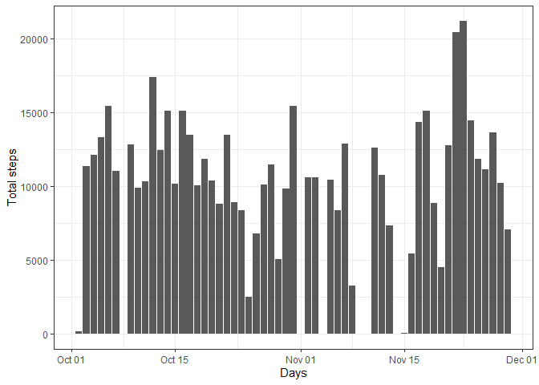
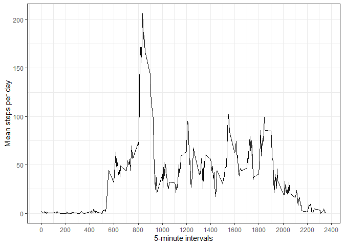
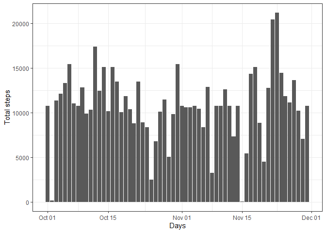
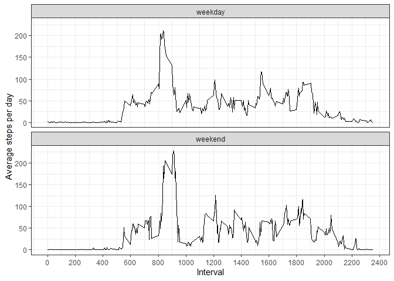

**R libraries we are going to use and system locale**  

```r
library(dplyr)
```

```
## 
## Attaching package: 'dplyr'
```

```
## The following objects are masked from 'package:stats':
## 
##     filter, lag
```

```
## The following objects are masked from 'package:base':
## 
##     intersect, setdiff, setequal, union
```

```r
library(data.table)
```

```
## 
## Attaching package: 'data.table'
```

```
## The following objects are masked from 'package:dplyr':
## 
##     between, first, last
```

```r
library(ggplot2)
Sys.setlocale('LC_ALL','English')
```

```
## [1] "LC_COLLATE=English_United States.1252;LC_CTYPE=English_United States.1252;LC_MONETARY=English_United States.1252;LC_NUMERIC=C;LC_TIME=English_United States.1252"
```

## Loading and preprocessing the data

First of all, we need to setup a code to check and create, if necessary, the directories we will need to store data and figures. We do so with the following code chunk.  

```r
datadir <- "./data"
figuredir <- "./figures"
if(!dir.exists(datadir)){
        dir.create(datadir)
}  
if(!dir.exists(figuredir)){
        dir.create(figuredir)
}
```

Now that we have where to store data, let's unzip the data set into the data directory and then load the data into R to start the analysis.


```r
if(!file.exists(paste0(datadir,"/activity.csv")) ){
        unzip("./activity.zip",exdir = datadir)        
}

activity <- fread(paste0(datadir,'/activity.csv'))
```

It's good practice to check what we have loaded, let's do so.


```r
str(activity)
```

```
## Classes 'data.table' and 'data.frame':	17568 obs. of  3 variables:
##  $ steps   : int  NA NA NA NA NA NA NA NA NA NA ...
##  $ date    : IDate, format: "2012-10-01" "2012-10-01" ...
##  $ interval: int  0 5 10 15 20 25 30 35 40 45 ...
##  - attr(*, ".internal.selfref")=<externalptr>
```

Look at that, data is correctly loaded. Now we are good to go deeper. And we will do so.

## What is mean total number of steps taken per day?

Let's make now a histogram showing number of steps per day using ggplot.  


```r
ggplot(data = activity, aes(x = date,y = steps)) +
        geom_histogram(stat = 'identity') +
        theme_bw() +
        labs(x = 'Days', y = 'Total steps')
```

<!-- -->
  
Let's check mean and median steps per day, filtering out NA values for now. 


```r
activity %>% 
        group_by(date) %>% 
        filter(!is.na(steps)) %>%
        summarise(stepsperday = sum(steps)) %>% 
        summarise('Mean steps per day' = mean(stepsperday),
                  'Median steps per day' = median(stepsperday) 
                  )
```

```
## `summarise()` ungrouping output (override with `.groups` argument)
```

```
## # A tibble: 1 x 2
##   `Mean steps per day` `Median steps per day`
##                  <dbl>                  <int>
## 1               10766.                  10765
```


## What is the average daily activity pattern?

We need to plot interval versus average of steps taken per day for each interval. First, we need to retrieve that kind of information, grouping by interval and date, then summing total steps at each group and averaging at last. 


```r
pattern <- activity %>%
        group_by(interval,date) %>%
        filter(!is.na(steps)) %>%
        summarise(stepsperintervalperday = sum(steps)) %>%
        summarise(meanstepsperday=mean(stepsperintervalperday))
```

```
## `summarise()` regrouping output by 'interval' (override with `.groups` argument)
```

```
## `summarise()` ungrouping output (override with `.groups` argument)
```

Now we can plot with ggplot.  


```r
ggplot(pattern, aes(x = interval, y = meanstepsperday)) +
        geom_line() +
        theme_bw() +
        labs(x = '5-minute intervals', y = 'Mean steps per day') + 
        scale_x_continuous(n.breaks = 15)
```

<!-- -->

Now, which interval has the highest average number of steps? From the plot we see it's close to the 800 minute interval. Let's take a look at the actual value here.  


```r
pattern %>% filter(meanstepsperday == max(pattern$meanstepsperday) )
```

```
## # A tibble: 1 x 2
##   interval meanstepsperday
##      <int>           <dbl>
## 1      835            206.
```


## Imputing missing values

Missing values were filtered out up until now, but this may introduce bias. Let's solve this issue now. How many row have missing value?  

```r
summary(activity)
```

```
##      steps             date               interval     
##  Min.   :  0.00   Min.   :2012-10-01   Min.   :   0.0  
##  1st Qu.:  0.00   1st Qu.:2012-10-16   1st Qu.: 588.8  
##  Median :  0.00   Median :2012-10-31   Median :1177.5  
##  Mean   : 37.38   Mean   :2012-10-31   Mean   :1177.5  
##  3rd Qu.: 12.00   3rd Qu.:2012-11-15   3rd Qu.:1766.2  
##  Max.   :806.00   Max.   :2012-11-30   Max.   :2355.0  
##  NA's   :2304
```

With the summary function we see there is missing values only at steps column. We can use the average steps per day and per interval we have just created in pattern to substitute this value. 

For that, we make a function that takes an interval and a step value and gives the average steps back if it was NA.  


```r
avgsteps<- function(inter,st){
        if(is.na(st)){
                return (subset(x=pattern, interval == inter)$meanstepsperday)
        }else{
                return (st)
        }
}
```

Now, let's make a new dataset substituting those missing values. 


```r
newactivity <- activity %>%
        mutate(newsteps = mapply(avgsteps,interval,steps))
```

Now a histogram to check the results


```r
ggplot(data = newactivity, aes(x = date,y = newsteps)) +
        geom_histogram(stat = 'identity') +
        theme_bw() +
        labs(x = 'Days', y = 'Total steps')
```

<!-- -->

We can see some days were filled in. How did it affect mean and median? 


```r
newactivity %>% 
        group_by(date) %>%
        summarise(stepsperday = sum(newsteps),.groups = 'drop') %>% 
        summarise('Mean steps per day' = mean(stepsperday),
                  'Median steps per day' = median(stepsperday)
                  )
```

```
## # A tibble: 1 x 2
##   `Mean steps per day` `Median steps per day`
##                  <dbl>                  <dbl>
## 1               10766.                 10766.
```
We can see there hasn't been barely any effect

## Are there differences in activity patterns between weekdays and weekends?

For this, we create variable daytype with factors weekday and weekend first


```r
newactivity <- newactivity %>% 
        mutate(daytype = weekdays(date,abbreviate=T)) %>% 
        mutate(daytype = as.factor(ifelse(daytype %in% c('Sat','Mon'),'weekend','weekday')))
```

Then we take the average much like before  


```r
pattern2 <- newactivity %>%
        group_by(interval,daytype,date) %>%
        summarise(stepsperintervalperday = sum(newsteps),) %>%
        summarise(meanstepsperday=mean(stepsperintervalperday),)
```

```
## `summarise()` regrouping output by 'interval', 'daytype' (override with `.groups` argument)
```

```
## `summarise()` regrouping output by 'interval' (override with `.groups` argument)
```

Now we can plot  


```r
ggplot(pattern2, aes(x= interval, y = meanstepsperday)) +
        geom_line() + 
        facet_wrap(. ~ daytype,ncol = 1,nrow = 2) +
        theme_bw() + labs(x = 'Interval', y = 'Average steps per day') +
  scale_x_continuous(n.breaks = 15)
```

<!-- -->

And that's all.
